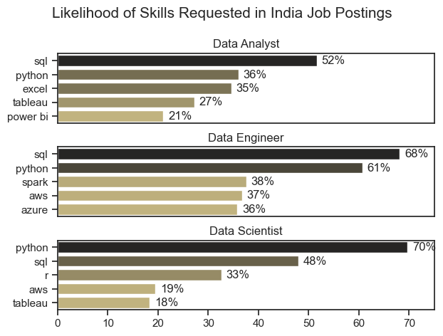
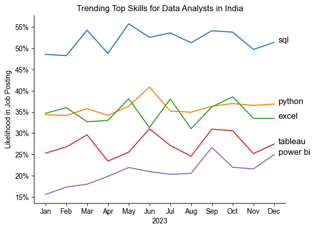
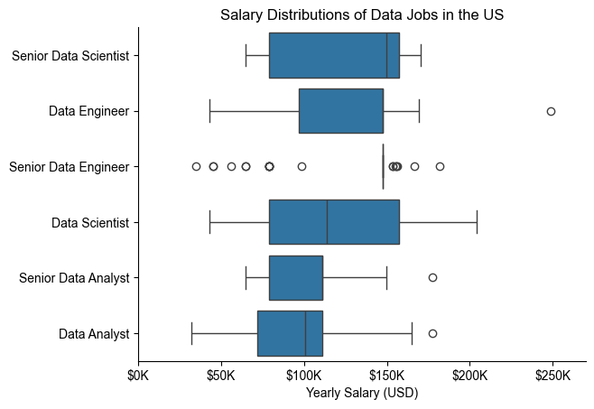
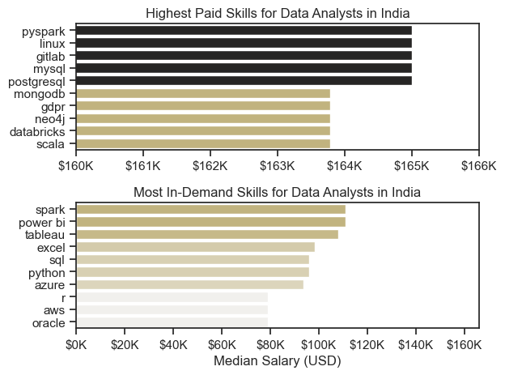
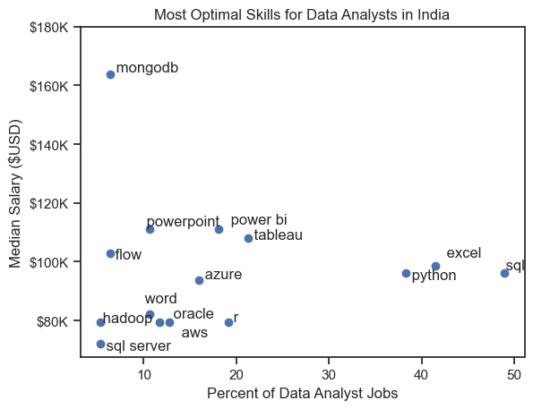
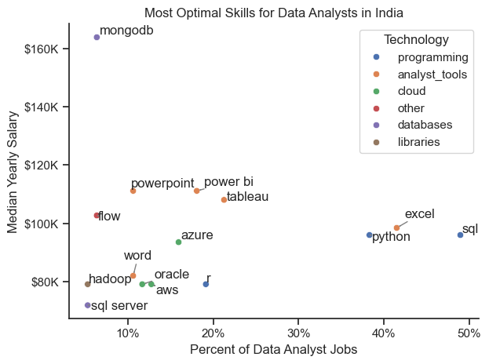

# Overview

Welcome to my analysis of the data job market, with a particular focus on data analyst roles. This project stems from a personal interest in better understanding and navigating the evolving job landscape. It explores the highest-paying and most in-demand skills to identify optimal career opportunities for aspiring and current data analysts.

The data used in this analysis is sourced from [Luke Barousse's Python Course](https://lukebarousse.com/python), which offers a comprehensive dataset covering job titles, salaries, locations, and key skills. Using a series of Python scripts, I examine critical aspects such as skill demand, salary patterns, and the relationship between compensation and required expertise in the field of data analytics.

# The Questions

Below are the questions I want to answer in my project:

1. What are the skills most in demand for the top 3 most popular data roles?
2. How are in-demand skills trending for Data Analysts?
3. How well do jobs and skills pay for Data Analysts?
4. What are the optimal skills for data analysts to learn? (High Demand AND High Paying) 

# Tools I Used

For my deep dive into the data analyst job market, I harnessed the power of several key tools:

- **Python:** The backbone of my analysis, allowing me to analyze the data and find critical insights.I also used the following Python libraries:
    - **Pandas Library:** This was used to analyze the data. 
    - **Matplotlib Library:** I visualized the data.
    - **Seaborn Library:** Helped me create more advanced visuals. 
- **Jupyter Notebooks:** The tool I used to run my Python scripts which let me easily include my notes and analysis.
- **Visual Studio Code:** My go-to for executing my Python scripts.
- **Git & GitHub:** Essential for version control and sharing my Python code and analysis, ensuring collaboration and project tracking.

# Data Preparation and Cleanup

This section outlines the steps taken to prepare the data for analysis, ensuring accuracy and usability.

## Import & Clean Up Data

I start by importing necessary libraries and loading the dataset, followed by initial data cleaning tasks to ensure data quality.

```python
# Importing Libraries
import ast
import pandas as pd
import seaborn as sns
from datasets import load_dataset
import matplotlib.pyplot as plt  

# Loading Data
dataset = load_dataset('lukebarousse/data_jobs')
df = dataset['train'].to_pandas()

# Data Cleanup
df['job_posted_date'] = pd.to_datetime(df['job_posted_date'])
df['job_skills'] = df['job_skills'].apply(lambda x: ast.literal_eval(x) if pd.notna(x) else x)
```

## Filter Indian Jobs

To focus my analysis on the Indian job market, I apply filters to the dataset, narrowing down to roles based in India.

```python
df_india = df[df['job_country'] == 'India']

```

# The Analysis

Each Jupyter notebook for this project aimed at investigating specific aspects of the data job market. Here’s how I approached each question:

## 1. What are the most demanded skills for the top 3 most popular data roles?

To find the most demanded skills for the top 3 most popular data roles. I filtered out those positions by which ones were the most popular, and got the top 5 skills for these top 3 roles. This query highlights the most popular job titles and their top skills, showing which skills I should pay attention to depending on the role I'm targeting. 

View my notebook with detailed steps here: [2_skill_demand](2_skill_demand.ipynb).

### Visualize Data

```python
fig, ax = plt.subplots(len(job_titles), 1)


for i, job_title in enumerate(job_titles):
    df_plot = df_skills_perc[df_skills_perc['job_title_short'] == job_title].head(5)
    sns.barplot(data=df_plot, x='skill_percent', y='job_skills', ax=ax[i], hue='skill_count', palette='dark:y_r')
    ax[i].set_title(job_title)
    ax[i].set_ylabel('')
    ax[i].set_xlabel('')
    ax[i].get_legend().remove()
    ax[i].set_xlim(0, 75)

    if i != len(job_titles) - 1:
        ax[i].set_xticks([])

    for n, v in enumerate(df_plot['skill_percent']):
        ax[i].text(v + 1, n, f'{v:.0f}%', va='center')

fig.suptitle('Likelihood of Skills Requested in India Job Postings', fontsize=15)
fig.tight_layout(h_pad=.8)
plt.show()
```

### Results



*Bar graph visualizing the salary for the top 3 data roles and their top 5 skills associated with each.*

### Insights:

- SQL is the most requested skill for Data Analysts (52%) and Data Scientists (48%), while Python is most in-demand for Data Scientists (70%) and Data Engineers (61%).
- Data Engineers require more backend and infrastructure-oriented skills such as AWS (37%), Azure (36%), and Spark (38%) compared to Data Analysts who lean towards Excel (35%), Tableau (27%), and Power BI (21%).
- R is a relatively niche but valued skill among Data Scientists (33%) and largely absent in Data Analyst and Data Engineer postings.

## 2. How are in-demand skills trending for Data Analysts?

To find how skills are trending in 2023 for Data Analysts, I filtered data analyst positions and grouped the skills by the month of the job postings. This got me the top 5 skills of data analysts by month, showing how popular skills were throughout 2023.

View my notebook with detailed steps here: [3_skills_trends](3_skills_trend.ipynb).

### Visualize Data

```python

from matplotlib.ticker import PercentFormatter

df_plot = df_india_percent.iloc[:, :5]
sns.lineplot(data=df_plot, dashes=False, legend='full', palette='tab10')
sns.set_theme(style='ticks')
sns.despine()

plt.title('Trending Top Skills for Data Analysts in India')
plt.ylabel('Likelihood in Job Posting')
plt.xlabel('2023')
plt.legend().remove()
plt.gca().yaxis.set_major_formatter(PercentFormatter(decimals=0))

for i in range(5):
    plt.text(11.2, df_plot.iloc[-1, i], df_plot.columns[i], color='black')

plt.show()


```

### Results

  
*Bar graph visualizing the trending top skills for data analysts in the India in 2023.*

### Insights:
- SQL maintained its position as the most mentioned skill throughout 2023, peaking around May and September.
- Python and Excel remained close in demand, trading second and third spots across months, with both ranging between 30%–40%.r.
- Tableau and Power BI consistently trailed behind but showed stable relevance across the year, indicating sustained interest in data visualization capabilities.

## 3. How well do jobs and skills pay for Data Analysts?

To identify the highest-paying roles and skills, I only got jobs in Indian and looked at their median salary. But first I looked at the salary distributions of common data jobs like Data Scientist, Data Engineer, and Data Analyst, to get an idea of which jobs are paid the most. 

View my notebook with detailed steps here: [4_salary_analysis](4_salary_analysis.ipynb).

#### Visualize Data 

```python
sns.boxplot(data=df_top6, x='salary_year_avg', y='job_title_short', order=job_order)
sns.set_theme(style='ticks')
sns.despine()

plt.title('Salary Distributions of Data Jobs in India')
plt.xlabel('Yearly Salary (USD)')
plt.ylabel('')
plt.xlim(0, 270000) 
ticks_x = plt.FuncFormatter(lambda y, pos: f'${int(y/1000)}K')
plt.gca().xaxis.set_major_formatter(ticks_x)
plt.show()

```

#### Results

  
*Box plot visualizing the salary distributions for the top 6 data job titles.*

#### Insights

- Senior Data Scientists have the highest median and upper salary ranges, often surpassing $160K, showing their strategic importance.

- Senior Data Engineers also receive high pay, comparable to Senior Data Scientists. However, the boxplot for Senior Data Engineer appears almost like a flat line, indicating that most salary data points are tightly clustered around the median, with very little variation in the interquartile range. This suggests more consistency in compensation, possibly due to standardized pay bands in organizations for infrastructure-heavy roles.

- Data Analysts, by contrast, occupy the lowest salary band, and although the Senior Data Analyst role shows some increase in pay, the step up is less pronounced compared to similar transitions in other roles, often prompting career pivots into data science or engineering for higher pay potential.
### Highest Paid & Most Demanded Skills for Data Analysts

Next, I narrowed my analysis and focused only on data analyst roles. I looked at the highest-paid skills and the most in-demand skills. I used two bar charts to showcase these.

#### Visualize Data

```python

ig, ax = plt.subplots(2, 1)  

sns.barplot(data=df_top_pay, x='median', y=df_top_pay.index, hue='median', ax=ax[0], palette='dark:y_r')
ax[0].legend().remove()

ax[0].set_title('Highest Paid Skills for Data Analysts in India')
ax[0].set_ylabel('')
ax[0].set_xlabel('')
ax[0].set_xlim(160000,166000)
ax[0].xaxis.set_major_formatter(plt.FuncFormatter(lambda x, _: f'${int(x/1000)}K'))


sns.barplot(data=df_skills, x='median', y=df_skills.index, hue='median', ax=ax[1], palette='light:y')
ax[1].legend().remove()

ax[1].set_title('Most In-Demand Skills for Data Analysts in India')
ax[1].set_ylabel('')
ax[1].set_xlabel('Median Salary (USD)')
ax[1].set_xlim(0, 166000)  # Set the same x-axis limits as the first plot
ax[1].xaxis.set_major_formatter(plt.FuncFormatter(lambda x, _: f'${int(x/1000)}K'))

sns.set_theme(style='ticks')
plt.tight_layout()
plt.show()

```

#### Results
Here's the breakdown of the highest-paid & most in-demand skills for data analysts in India:


*Two separate bar graphs visualizing the highest paid skills and most in-demand skills for data analysts in India.*

#### Insights:

- Some of the highest-paying skills—such as `PySpark`, `GitLab`, `MongoDB`, and `PostgreSQL`—offer median salaries around ₹1.65M but appear in less than 5% of job listings, indicating that these are highly specialized tools. Their value likely comes from being tied to advanced, production-level data workflows which fewer candidates may be skilled in.

- On the other hand, high-demand skills like `Excel`, `SQL`, `Python`, `Tableau`, and `Power BI` show up in 20%–50% of postings, reflecting their role as foundational tools for data analysis. However, they yield relatively lower salaries, especially Excel and Power BI, due to a saturated market and lower technical complexity.

- There's a clear distinction between the skills that are highest paid and those that are most in-demand. Data analysts aiming to maximize their career potential should consider developing a diverse skill set that includes both high-paying specialized skills and widely demanded foundational skills.

## 4. What are the most optimal skills to learn for Data Analysts?

To identify the most optimal skills to learn ( the ones that are the highest paid and highest in demand) I calculated the percent of skill demand and the median salary of these skills. To easily identify which are the most optimal skills to learn. 

View my notebook with detailed steps here: [5_optimal_skills](5_optimal_skills.ipynb).

#### Visualize Data

```python
from adjustText import adjust_text

plt.scatter(df_hdem['skill_percent'], df_hdem['median_salary'])
plt.xlabel('Percent of Data Analyst Jobs')
plt.ylabel('Median Salary ($USD)')
plt.title('Most Optimal Skills for Data Analysts in India')

ax = plt.gca()
ax.yaxis.set_major_formatter(plt.FuncFormatter(lambda y, pos: f'${int(y/1000)}K'))

texts = []
for i, txt in enumerate(df_hdem.index):
    texts.append(plt.text(df_hdem['skill_percent'].iloc[i], df_hdem['median_salary'].iloc[i], " " + txt))

adjust_text(texts)

plt.ylim(top=180000)
plt.show()

```

#### Results

    
*A scatter plot visualizing the most optimal skills (high paying & high demand) for data analysts in India.*

#### Insights:

- `MongoDB` offers the best trade-off in terms of salary-to-demand ratio, with a median salary above ₹1.6M despite being mentioned in only about 8% of listings. This suggests that learning such in-demand-but-underrepresented technologies could significantly increase earning potential.

- Tools like `Power BI`, `Tableau`, `Flow`, and `PowerPoin`t form a middle tier—they are not in the top 3 for either salary or demand but strike a solid balance. These tools are frequently used in business reporting and dashboards, which makes them attractive to both employers and candidates seeking practical, employable skills.

- `SQL`, `Python`, and `Excel` dominate the job listings, appearing in over 40% of postings, but their median salaries are noticeably lower (₹800K–₹1M). This reflects their status as essential but non-differentiating skills—employers expect candidates to know them, so they don’t drive compensation upward on their own.

### Visualizing Different Techonologies

Let's visualize the different technologies as well in the graph. We'll add color labels based on the technology (e.g., {Programming: Python})

#### Visualize Data

```python
sns.scatterplot(
    data=df_tech_hdem,
    x='skill_percent',
    y='median_salary',
    hue='technology'
)

sns.despine()
sns.set_theme(style='ticks')

texts = []
for i, txt in enumerate(df_hdem.index):
    texts.append(plt.text(df_hdem['skill_percent'].iloc[i], df_hdem['median_salary'].iloc[i], txt))

adjust_text(texts, arrowprops=dict(arrowstyle='->', color='gray'))

plt.xlabel('Percent of Data Analyst Jobs')
plt.ylabel('Median Yearly Salary')
plt.title('Most Optimal Skills for Data Analysts in India')
plt.legend(title='Technology')

from matplotlib.ticker import PercentFormatter
ax = plt.gca()
ax.yaxis.set_major_formatter(plt.FuncFormatter(lambda y, pos: f'${int(y/1000)}K'))
ax.xaxis.set_major_formatter(PercentFormatter(decimals=0))

plt.tight_layout()
plt.show()

```

#### Results

  
*A scatter plot visualizing the most optimal skills (high paying & high demand) for data analysts in India with color labels for technology.*

#### Insights:

- Among database tools, `MongoDB` stands out with the highest pay (~₹1.7M), while traditional relational databases like `SQL Server` and `Oracle` appear more frequently but offer lower pay (~₹1M). This indicates newer NoSQL technologies are valued in more modern or complex data environments.

- In terms of programming, `SQL` and `Python` remain the most in-demand, present in over 40% of listings. However, their median salaries (~₹950K–₹1.1M) suggest that while they are essential, they do not offer premium pay. `R` is used less often and also yields lower pay, highlighting its reduced popularity in India’s job market.

- Among cloud and visualization tools, `Power BI` and `Tableau` strike a great balance—well-paid (₹1.1M–₹1.3M) and frequently required, making them ideal for analysts aiming to stay relevant. In contrast, niche tools like `GDPR`, `Neo4j`, and `Airflow` offer very high salaries but appear in very few postings, meaning they are valuable only for specific roles or companies.

# What I Learned

Throughout this project, I gained deeper insights into the data analyst job market while significantly strengthening my technical proficiency in Python, particularly in data manipulation and visualization. Some key takeaways from the experience include:

- **Advanced Python Usage**: I enhanced my ability to work with powerful libraries such as Pandas for data manipulation, and Seaborn and Matplotlib for data visualization. These tools enabled me to carry out complex analytical tasks with greater efficiency and clarity.
- **Data Cleaning Importance**: I recognized the critical role of data cleaning and preparation in the analytical process. Ensuring data quality is essential to generate accurate, reliable insights that can drive informed decision-making.
- **Strategic Skill Analysis**: This project underscored the importance of aligning personal skill development with market trends. By understanding how demand, salary, and job availability intersect, I’m now better equipped to make informed, strategic decisions about my career path in the tech and analytics space.


# Insights

This project provided several general insights into the data job market for analysts:

- **Link Between Skill Demand and Compensation**: Salaries tend to rise with the demand for specific technical skills. Proficiencies in advanced tools like Python and Oracle often result in higher pay, highlighting the financial benefit of acquiring specialized capabilities.
- **Shifting Industry Trends**: The demand for particular skills evolves over time, reflecting the fast-paced nature of the data analytics field. Staying current with these trends is crucial for continued career advancement.
- **Maximizing Skill Value**: By focusing on skills that are both in high demand and well-compensated, data analysts can make informed decisions about their professional development, optimizing their potential for economic gain.


# Challenges I Faced

This project presented several challenges that also served as valuable learning experiences:

- **Data Inconsistencies**: Dealing with missing or inconsistent data required careful data-cleaning strategies to maintain analytical accuracy and ensure the reliability of insights.
- **Complex Data Visualization**: Translating complex datasets into clear, meaningful visualizations was a demanding task, but essential for effectively communicating findings to a broader audience.
- **Balancing Breadth and Depth**: Determining the appropriate level of detail in the analysis, while still capturing a comprehensive view of the data landscape, required thoughtful prioritization and scope management.


# Conclusion

This exploration of the data analyst job market has been highly insightful, shedding light on the key skills and trends that are driving this dynamic field. The knowledge gained offers valuable direction for those aiming to grow their careers in data analytics. As the industry continues to evolve, ongoing research will be crucial to staying competitive. This project serves as a strong starting point for future investigations and highlights the importance of lifelong learning and adaptability in the data profession.


